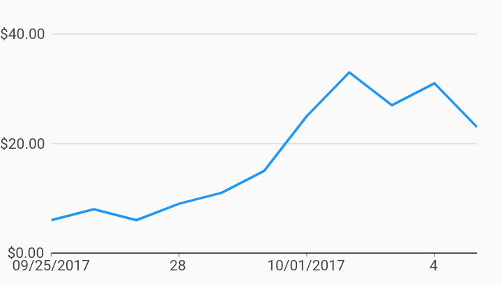

# Custom Axis Tick Formatters Axes Example



Example:

```
/// Example of timeseries chart with custom measure and domain formatters.
import 'package:charts_flutter_web/flutter.dart' as charts;
import 'package:flutter_web/material.dart';
import 'package:intl/intl.dart';

class CustomAxisTickFormatters extends StatelessWidget {
  final List<charts.Series> seriesList;
  final bool animate;

  CustomAxisTickFormatters(this.seriesList, {this.animate});

  /// Creates a [TimeSeriesChart] with sample data and no transition.
  factory CustomAxisTickFormatters.withSampleData() {
    return  CustomAxisTickFormatters(
      _createSampleData(),
      // Disable animations for image tests.
      animate: false,
    );
  }


  @override
  Widget build(BuildContext context) {
    /// Formatter for numeric ticks using [NumberFormat] to format into currency
    ///
    /// This is what is used in the [NumericAxisSpec] below.
    final simpleCurrencyFormatter =
         charts.BasicNumericTickFormatterSpec.fromNumberFormat(
             NumberFormat.compactSimpleCurrency());

    /// Formatter for numeric ticks that uses the callback provided.
    ///
    /// Use this formatter if you need to format values that [NumberFormat]
    /// cannot provide.
    ///
    /// To see this formatter, change [NumericAxisSpec] to use this formatter.
    // final customTickFormatter =
    //   charts.BasicNumericTickFormatterSpec((num value) => 'MyValue: $value');

    return  charts.TimeSeriesChart(seriesList,
        animate: animate,
        // Sets up a currency formatter for the measure axis.
        primaryMeasureAxis:  charts.NumericAxisSpec(
            tickFormatterSpec: simpleCurrencyFormatter),

        /// Customizes the date tick formatter. It will print the day of month
        /// as the default format, but include the month and year if it
        /// transitions to a  month.
        ///
        /// minute, hour, day, month, and year are all provided by default and
        /// you can override them following this pattern.
        domainAxis:  charts.DateTimeAxisSpec(
            tickFormatterSpec:  charts.AutoDateTimeTickFormatterSpec(
                day:  charts.TimeFormatterSpec(
                    format: 'd', transitionFormat: 'MM/dd/yyyy'))));
  }

  /// Create one series with sample hard coded data.
  static List<charts.Series<MyRow, DateTime>> _createSampleData() {
    final data = [
       MyRow( DateTime(2017, 9, 25), 6),
       MyRow( DateTime(2017, 9, 26), 8),
       MyRow( DateTime(2017, 9, 27), 6),
       MyRow( DateTime(2017, 9, 28), 9),
       MyRow( DateTime(2017, 9, 29), 11),
       MyRow( DateTime(2017, 9, 30), 15),
       MyRow( DateTime(2017, 10, 01), 25),
       MyRow( DateTime(2017, 10, 02), 33),
       MyRow( DateTime(2017, 10, 03), 27),
       MyRow( DateTime(2017, 10, 04), 31),
       MyRow( DateTime(2017, 10, 05), 23),
    ];

    return [
       charts.Series<MyRow, DateTime>(
        id: 'Cost',
        domainFn: (MyRow row, _) => row.timeStamp,
        measureFn: (MyRow row, _) => row.cost,
        data: data,
      )
    ];
  }
}

/// Sample time series data type.
class MyRow {
  final DateTime timeStamp;
  final int cost;
  MyRow(this.timeStamp, this.cost);
}
```
