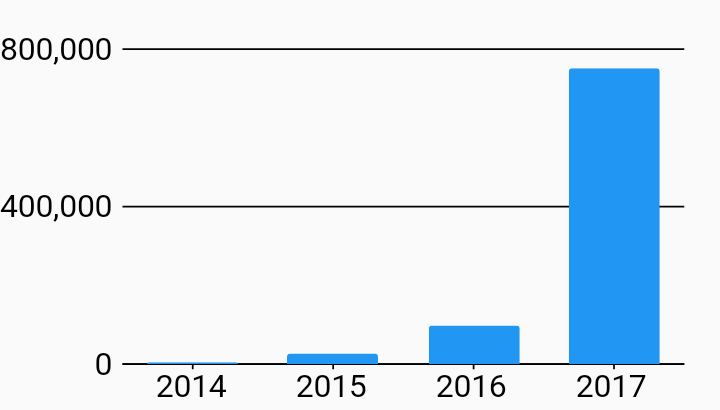

# Custom Font Size And Color Axes Example



Example:

```
/// Custom Font Style Example
import 'package:flutter_web/material.dart';
import 'package:charts_flutter_web/flutter.dart' as charts;

/// Example of using a custom primary measure and domain axis replacing the
/// renderSpec with one with a custom font size and a custom color.
///
/// There are many axis styling options in the SmallTickRenderer allowing you
/// to customize the font, tick lengths, and offsets.
class CustomFontSizeAndColor extends StatelessWidget {
  final List<charts.Series> seriesList;
  final bool animate;

  CustomFontSizeAndColor(this.seriesList, {this.animate});

  factory CustomFontSizeAndColor.withSampleData() {
    return  CustomFontSizeAndColor(
      _createSampleData(),
      // Disable animations for image tests.
      animate: false,
    );
  }


  @override
  Widget build(BuildContext context) {
    return  charts.BarChart(
      seriesList,
      animate: animate,

      /// Assign a custom style for the domain axis.
      ///
      /// This is an OrdinalAxisSpec to match up with BarChart's default
      /// ordinal domain axis (use NumericAxisSpec or DateTimeAxisSpec for
      /// other charts).
      domainAxis:  charts.OrdinalAxisSpec(
          renderSpec:  charts.SmallTickRendererSpec(

              // Tick and Label styling here.
              labelStyle:  charts.TextStyleSpec(
                  fontSize: 18, // size in Pts.
                  color: charts.MaterialPalette.black),

              // Change the line colors to match text color.
              lineStyle:  charts.LineStyleSpec(
                  color: charts.MaterialPalette.black))),

      /// Assign a custom style for the measure axis.
      primaryMeasureAxis:  charts.NumericAxisSpec(
          renderSpec:  charts.GridlineRendererSpec(

              // Tick and Label styling here.
              labelStyle:  charts.TextStyleSpec(
                  fontSize: 18, // size in Pts.
                  color: charts.MaterialPalette.black),

              // Change the line colors to match text color.
              lineStyle:  charts.LineStyleSpec(
                  color: charts.MaterialPalette.black))),
    );
  }

  /// Create series list with single series
  static List<charts.Series<OrdinalSales, String>> _createSampleData() {
    final globalSalesData = [
       OrdinalSales('2014', 5000),
       OrdinalSales('2015', 25000),
       OrdinalSales('2016', 100000),
       OrdinalSales('2017', 750000),
    ];

    return [
       charts.Series<OrdinalSales, String>(
        id: 'Global Revenue',
        domainFn: (OrdinalSales sales, _) => sales.year,
        measureFn: (OrdinalSales sales, _) => sales.sales,
        data: globalSalesData,
      ),
    ];
  }
}

/// Sample ordinal data type.
class OrdinalSales {
  final String year;
  final int sales;

  OrdinalSales(this.year, this.sales);
}
```
