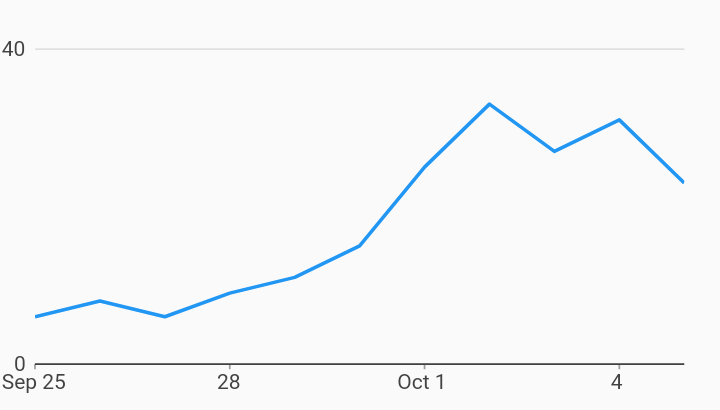

# Custom Measure Tick Count Axes Example



Example:

```
/// Example of timeseries chart with a custom number of ticks
///
/// The tick count can be set by setting the [desiredMinTickCount] and
/// [desiredMaxTickCount] for automatically adjusted tick counts (based on
/// how 'nice' the ticks are) or [desiredTickCount] for a fixed tick count.
import 'package:charts_flutter_web/flutter.dart' as charts;
import 'package:flutter_web/material.dart';

class CustomMeasureTickCount extends StatelessWidget {
  final List<charts.Series> seriesList;
  final bool animate;

  CustomMeasureTickCount(this.seriesList, {this.animate});

  /// Creates a [TimeSeriesChart] with sample data and no transition.
  factory CustomMeasureTickCount.withSampleData() {
    return  CustomMeasureTickCount(
      _createSampleData(),
      // Disable animations for image tests.
      animate: false,
    );
  }


  @override
  Widget build(BuildContext context) {
    return  charts.TimeSeriesChart(seriesList,
        animate: animate,

        /// Customize the measure axis to have 2 ticks,
        primaryMeasureAxis:  charts.NumericAxisSpec(
            tickProviderSpec:
                 charts.BasicNumericTickProviderSpec(desiredTickCount: 2)));
  }

  /// Create one series with sample hard coded data.
  static List<charts.Series<MyRow, DateTime>> _createSampleData() {
    final data = [
       MyRow( DateTime(2017, 9, 25), 6),
       MyRow( DateTime(2017, 9, 26), 8),
       MyRow( DateTime(2017, 9, 27), 6),
       MyRow( DateTime(2017, 9, 28), 9),
       MyRow( DateTime(2017, 9, 29), 11),
       MyRow( DateTime(2017, 9, 30), 15),
       MyRow( DateTime(2017, 10, 01), 25),
       MyRow( DateTime(2017, 10, 02), 33),
       MyRow( DateTime(2017, 10, 03), 27),
       MyRow( DateTime(2017, 10, 04), 31),
       MyRow( DateTime(2017, 10, 05), 23),
    ];

    return [
       charts.Series<MyRow, DateTime>(
        id: 'Cost',
        domainFn: (MyRow row, _) => row.timeStamp,
        measureFn: (MyRow row, _) => row.cost,
        data: data,
      )
    ];
  }
}

/// Sample time series data type.
class MyRow {
  final DateTime timeStamp;
  final int cost;
  MyRow(this.timeStamp, this.cost);
}
```
