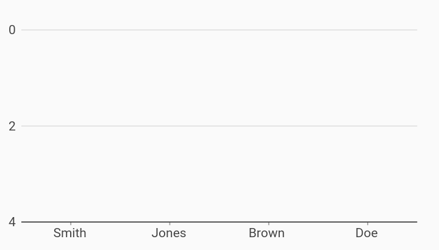

# Flipped Vertical Axis Axes Example



Example:

```
/// Bar chart example
import 'package:flutter_web/material.dart';
import 'package:charts_flutter_web/flutter.dart' as charts;

/// Example of flipping the vertical measure axis direction so that larger values render
/// downward instead of the usual rendering up.
///
/// flipVerticalAxis, when set, flips the vertical axis from its default direction.
///
/// Note: primary and secondary may flip left and right positioning when
/// RTL.flipAxisLocations is set.
class FlippedVerticalAxis extends StatelessWidget {
  final List<charts.Series> seriesList;
  final bool animate;

  FlippedVerticalAxis(this.seriesList, {this.animate});

  factory FlippedVerticalAxis.withSampleData() {
    return  FlippedVerticalAxis(
      _createSampleData(),
      // Disable animations for image tests.
      animate: false,
    );
  }


  @override
  Widget build(BuildContext context) {
    return  charts.BarChart(
      seriesList,
      animate: animate,
      flipVerticalAxis: true,
    );
  }

  /// Create series list with multiple series
  static List<charts.Series<RunnerRank, String>> _createSampleData() {
    final raceData = [
       RunnerRank('Smith', 1),
       RunnerRank('Jones', 2),
       RunnerRank('Brown', 3),
       RunnerRank('Doe', 4),
    ];

    return [
       charts.Series<RunnerRank, String>(
          id: 'Race Results',
          domainFn: (RunnerRank row, _) => row.name,
          measureFn: (RunnerRank row, _) => row.place,
          data: raceData),
    ];
  }
}

/// Datum/Row for the chart.
class RunnerRank {
  final String name;
  final int place;
  RunnerRank(this.name, this.place);
}
```
