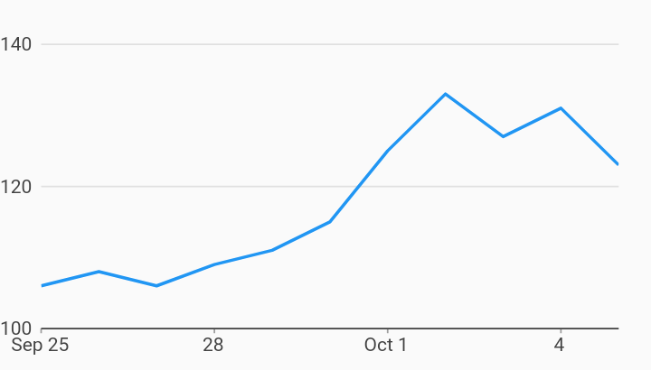

# Nonzero Bound Measure Axis Axes Example



Example:

```
/// Example of timeseries chart that has a measure axis that does NOT include
/// zero. It starts at 100 and goes to 140.
import 'package:charts_flutter_web/flutter.dart' as charts;
import 'package:flutter_web/material.dart';

class NonzeroBoundMeasureAxis extends StatelessWidget {
  final List<charts.Series> seriesList;
  final bool animate;

  NonzeroBoundMeasureAxis(this.seriesList, {this.animate});

  /// Creates a [TimeSeriesChart] with sample data and no transition.
  factory NonzeroBoundMeasureAxis.withSampleData() {
    return  NonzeroBoundMeasureAxis(
      _createSampleData(),
      // Disable animations for image tests.
      animate: false,
    );
  }


  @override
  Widget build(BuildContext context) {
    return  charts.TimeSeriesChart(seriesList,
        animate: animate,
        // Provide a tickProviderSpec which does NOT require that zero is
        // included.
        primaryMeasureAxis:  charts.NumericAxisSpec(
            tickProviderSpec:
                 charts.BasicNumericTickProviderSpec(zeroBound: false)));
  }

  /// Create one series with sample hard coded data.
  static List<charts.Series<MyRow, DateTime>> _createSampleData() {
    final data = [
       MyRow( DateTime(2017, 9, 25), 106),
       MyRow( DateTime(2017, 9, 26), 108),
       MyRow( DateTime(2017, 9, 27), 106),
       MyRow( DateTime(2017, 9, 28), 109),
       MyRow( DateTime(2017, 9, 29), 111),
       MyRow( DateTime(2017, 9, 30), 115),
       MyRow( DateTime(2017, 10, 01), 125),
       MyRow( DateTime(2017, 10, 02), 133),
       MyRow( DateTime(2017, 10, 03), 127),
       MyRow( DateTime(2017, 10, 04), 131),
       MyRow( DateTime(2017, 10, 05), 123),
    ];

    return [
       charts.Series<MyRow, DateTime>(
        id: 'Headcount',
        domainFn: (MyRow row, _) => row.timeStamp,
        measureFn: (MyRow row, _) => row.headcount,
        data: data,
      )
    ];
  }
}

/// Sample time series data type.
class MyRow {
  final DateTime timeStamp;
  final int headcount;
  MyRow(this.timeStamp, this.headcount);
}
```
