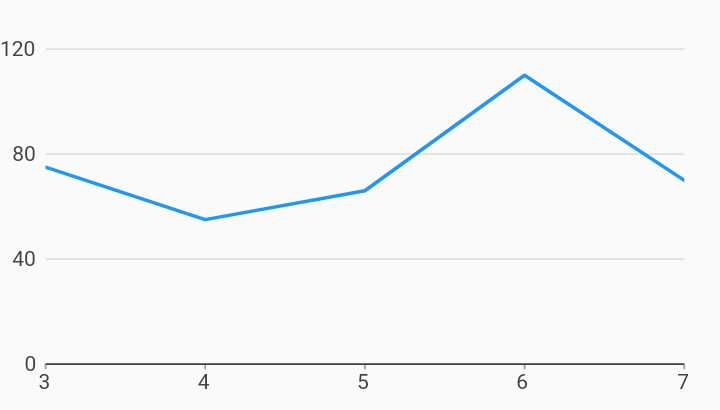

# Numeric Initial Viewport Axes Example



Example:

```
/// Example of setting an initial viewport for ordinal axis.
///
/// This allows for specifying the specific range of data to show that differs
/// from what was provided in the series list.
///
/// In this example, the series list has numeric data from 0 to 10, but we
/// want to show from 3 to 7.
/// We can do this by specifying an [NumericExtents] in [NumericAxisSpec].

import 'package:charts_flutter_web/flutter.dart' as charts;
import 'package:flutter_web/material.dart';

class NumericInitialViewport extends StatelessWidget {
  final List<charts.Series> seriesList;
  final bool animate;

  NumericInitialViewport(this.seriesList, {this.animate});

  /// Creates a [LineChart] with sample data and no transition.
  factory NumericInitialViewport.withSampleData() {
    return  NumericInitialViewport(
      _createSampleData(),
      // Disable animations for image tests.
      animate: false,
    );
  }


  @override
  Widget build(BuildContext context) {
    return  charts.LineChart(
      seriesList,
      animate: animate,
      domainAxis:  charts.NumericAxisSpec(
          // Set the initial viewport by providing a  AxisSpec with the
          // desired viewport, in NumericExtents.
          viewport:  charts.NumericExtents(3.0, 7.0)),
      // Optionally add a pan or pan and zoom behavior.
      // If pan/zoom is not added, the viewport specified remains the viewport.
      behaviors: [ charts.PanAndZoomBehavior()],
    );
  }

  /// Create one series with sample hard coded data.
  static List<charts.Series<LinearSales, int>> _createSampleData() {
    final data = [
       LinearSales(0, 5),
       LinearSales(1, 25),
       LinearSales(2, 100),
       LinearSales(3, 75),
       LinearSales(4, 55),
       LinearSales(5, 66),
       LinearSales(6, 110),
       LinearSales(7, 70),
       LinearSales(8, 20),
       LinearSales(9, 25),
       LinearSales(10, 45),
    ];

    return [
       charts.Series<LinearSales, int>(
        id: 'Sales',
        colorFn: (_, __) => charts.MaterialPalette.blue.shadeDefault,
        domainFn: (LinearSales sales, _) => sales.year,
        measureFn: (LinearSales sales, _) => sales.sales,
        data: data,
      )
    ];
  }
}

/// Sample linear data type.
class LinearSales {
  final int year;
  final int sales;

  LinearSales(this.year, this.sales);
}
```
