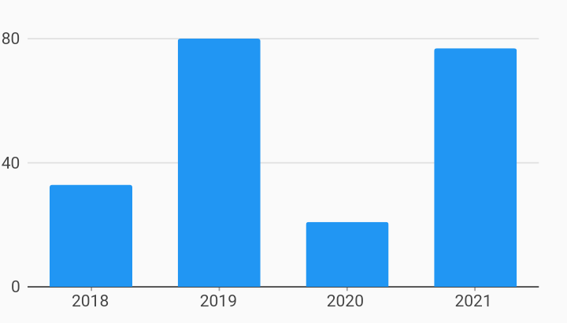

# Ordinal Initial Viewport Axes Example



Example:

```
/// Example of setting an initial viewport for ordinal axis.
///
/// This allows for specifying the specific range of data to show that differs
/// from what was provided in the series list.
///
/// In this example, the series list has ordinal data from year 2014 to 2030,
/// but we want to show starting at 2018 and we only want to show 4 values.
/// We can do this by specifying an [OrdinalViewport] in [OrdinalAxisSpec].

import 'package:charts_flutter_web/flutter.dart' as charts;
import 'package:flutter_web/material.dart';

class OrdinalInitialViewport extends StatelessWidget {
  final List<charts.Series> seriesList;
  final bool animate;

  OrdinalInitialViewport(this.seriesList, {this.animate});

  /// Creates a [BarChart] with sample data and no transition.
  factory OrdinalInitialViewport.withSampleData() {
    return  OrdinalInitialViewport(
      _createSampleData(),
      // Disable animations for image tests.
      animate: false,
    );
  }


  @override
  Widget build(BuildContext context) {
    return  charts.BarChart(
      seriesList,
      animate: animate,
      // Set the initial viewport by providing a  AxisSpec with the
      // desired viewport: a starting domain and the data size.
      domainAxis:  charts.OrdinalAxisSpec(
          viewport:  charts.OrdinalViewport('2018', 4)),
      // Optionally add a pan or pan and zoom behavior.
      // If pan/zoom is not added, the viewport specified remains the viewport.
      behaviors: [ charts.PanAndZoomBehavior()],
    );
  }

  /// Create one series with sample hard coded data.
  static List<charts.Series<OrdinalSales, String>> _createSampleData() {
    final data = [
       OrdinalSales('2014', 5),
       OrdinalSales('2015', 25),
       OrdinalSales('2016', 100),
       OrdinalSales('2017', 75),
       OrdinalSales('2018', 33),
       OrdinalSales('2019', 80),
       OrdinalSales('2020', 21),
       OrdinalSales('2021', 77),
       OrdinalSales('2022', 8),
       OrdinalSales('2023', 12),
       OrdinalSales('2024', 42),
       OrdinalSales('2025', 70),
       OrdinalSales('2026', 77),
       OrdinalSales('2027', 55),
       OrdinalSales('2028', 19),
       OrdinalSales('2029', 66),
       OrdinalSales('2030', 27),
    ];

    return [
       charts.Series<OrdinalSales, String>(
        id: 'Sales',
        colorFn: (_, __) => charts.MaterialPalette.blue.shadeDefault,
        domainFn: (OrdinalSales sales, _) => sales.year,
        measureFn: (OrdinalSales sales, _) => sales.sales,
        data: data,
      )
    ];
  }
}

/// Sample ordinal data type.
class OrdinalSales {
  final String year;
  final int sales;

  OrdinalSales(this.year, this.sales);
}
```
