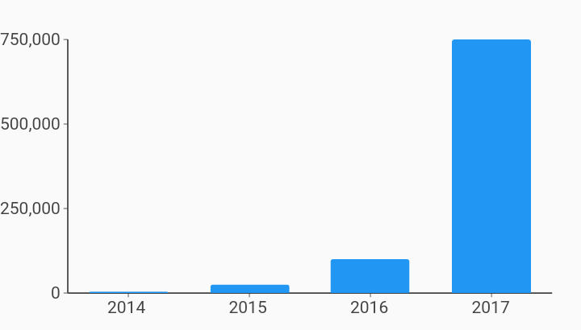

# Short Tick Length Axis Axes Example



Example:

```
/// Custom Tick Style Example
import 'package:flutter_web/material.dart';
import 'package:charts_flutter_web/flutter.dart' as charts;

/// Example of using a custom primary measure axis replacing the default
/// gridline rendering with a short tick rendering. It also turns on the axis
/// line so that the ticks have something to line up against.
///
/// There are many axis styling options in the SmallTickRenderer allowing you
/// to customize the font, tick lengths, and offsets.
class ShortTickLengthAxis extends StatelessWidget {
  final List<charts.Series> seriesList;
  final bool animate;

  ShortTickLengthAxis(this.seriesList, {this.animate});

  factory ShortTickLengthAxis.withSampleData() {
    return  ShortTickLengthAxis(
      _createSampleData(),
      // Disable animations for image tests.
      animate: false,
    );
  }


  @override
  Widget build(BuildContext context) {
    return  charts.BarChart(
      seriesList,
      animate: animate,

      /// Customize the primary measure axis using a small tick renderer.
      /// Note: use String instead of num for ordinal domain axis
      /// (typically bar charts).
      primaryMeasureAxis:  charts.NumericAxisSpec(
          renderSpec:  charts.SmallTickRendererSpec(
              // Tick and Label styling here.
              )),
    );
  }

  /// Create series list with single series
  static List<charts.Series<OrdinalSales, String>> _createSampleData() {
    final globalSalesData = [
       OrdinalSales('2014', 5000),
       OrdinalSales('2015', 25000),
       OrdinalSales('2016', 100000),
       OrdinalSales('2017', 750000),
    ];

    return [
       charts.Series<OrdinalSales, String>(
        id: 'Global Revenue',
        domainFn: (OrdinalSales sales, _) => sales.year,
        measureFn: (OrdinalSales sales, _) => sales.sales,
        data: globalSalesData,
      ),
    ];
  }
}

/// Sample ordinal data type.
class OrdinalSales {
  final String year;
  final int sales;

  OrdinalSales(this.year, this.sales);
}
```
