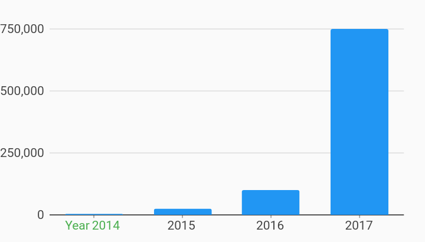

# Statically Provided Ticks Axes Example



Example:

```
/// Example of axis using statically provided ticks.
import 'package:flutter_web/material.dart';
import 'package:charts_flutter_web/flutter.dart' as charts;

/// Example of specifying a custom set of ticks to be used on the domain axis.
///
/// Specifying custom set of ticks allows specifying exactly what ticks are
/// used in the axis. Each tick is also allowed to have a different style set.
///
/// For an ordinal axis, the [StaticOrdinalTickProviderSpec] is shown in this
/// example defining ticks to be used with [TickSpec] of String.
///
/// For numeric axis, the [StaticNumericTickProviderSpec] can be used by passing
/// in a list of ticks defined with [TickSpec] of num.
///
/// For datetime axis, the [StaticDateTimeTickProviderSpec] can be used by
/// passing in a list of ticks defined with [TickSpec] of datetime.
class StaticallyProvidedTicks extends StatelessWidget {
  final List<charts.Series> seriesList;
  final bool animate;

  StaticallyProvidedTicks(this.seriesList, {this.animate});

  factory StaticallyProvidedTicks.withSampleData() {
    return  StaticallyProvidedTicks(
      _createSampleData(),
      // Disable animations for image tests.
      animate: false,
    );
  }


  @override
  Widget build(BuildContext context) {
    // Create the ticks to be used the domain axis.
    final staticTicks = <charts.TickSpec<String>>[
       charts.TickSpec(
          // Value must match the domain value.
          '2014',
          // Optional label for this tick, defaults to domain value if not set.
          label: 'Year 2014',
          // The styling for this tick.
          style:  charts.TextStyleSpec(
              color:  charts.Color(r: 0x4C, g: 0xAF, b: 0x50))),
      // If no text style is specified - the style from renderSpec will be used
      // if one is specified.
       charts.TickSpec('2015'),
       charts.TickSpec('2016'),
       charts.TickSpec('2017'),
    ];

    return  charts.BarChart(
      seriesList,
      animate: animate,
      domainAxis:  charts.OrdinalAxisSpec(
          tickProviderSpec:
               charts.StaticOrdinalTickProviderSpec(staticTicks)),
    );
  }

  /// Create series list with single series
  static List<charts.Series<OrdinalSales, String>> _createSampleData() {
    final globalSalesData = [
       OrdinalSales('2014', 5000),
       OrdinalSales('2015', 25000),
       OrdinalSales('2016', 100000),
       OrdinalSales('2017', 750000),
    ];

    return [
       charts.Series<OrdinalSales, String>(
        id: 'Global Revenue',
        domainFn: (OrdinalSales sales, _) => sales.year,
        measureFn: (OrdinalSales sales, _) => sales.sales,
        data: globalSalesData,
      ),
    ];
  }
}

/// Sample ordinal data type.
class OrdinalSales {
  final String year;
  final int sales;

  OrdinalSales(this.year, this.sales);
}
```
