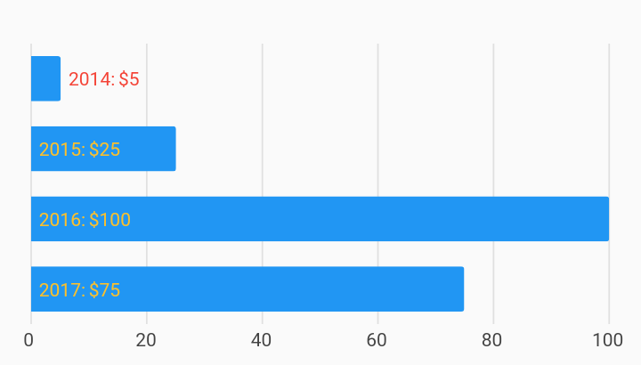

# Horizontal Bar Label Custom Bar Chart Example



Example:

```
/// Horizontal bar chart with custom style for each datum in the bar label.
import 'package:charts_flutter_web/flutter.dart' as charts;
import 'package:flutter_web/material.dart';

class HorizontalBarLabelCustomChart extends StatelessWidget {
  final List<charts.Series> seriesList;
  final bool animate;

  HorizontalBarLabelCustomChart(this.seriesList, {this.animate});

  /// Creates a [BarChart] with sample data and no transition.
  static HorizontalBarLabelCustomChart createWithSampleData() {
    return  HorizontalBarLabelCustomChart(
      _createSampleData(),
      // Disable animations for image tests.
      animate: false,
    );
  }


  // The [BarLabelDecorator] has settings to set the text style for all labels
  // for inside the bar and outside the bar. To be able to control each datum's
  // style, set the style accessor functions on the series.
  @override
  Widget build(BuildContext context) {
    return  charts.BarChart(
      seriesList,
      animate: animate,
      vertical: false,
      barRendererDecorator:  charts.BarLabelDecorator<String>(),
      // Hide domain axis.
      domainAxis:
           charts.OrdinalAxisSpec(renderSpec:  charts.NoneRenderSpec()),
    );
  }

  /// Create one series with sample hard coded data.
  static List<charts.Series<OrdinalSales, String>> _createSampleData() {
    final data = [
       OrdinalSales('2014', 5),
       OrdinalSales('2015', 25),
       OrdinalSales('2016', 100),
       OrdinalSales('2017', 75),
    ];

    return [
       charts.Series<OrdinalSales, String>(
        id: 'Sales',
        domainFn: (OrdinalSales sales, _) => sales.year,
        measureFn: (OrdinalSales sales, _) => sales.sales,
        data: data,
        // Set a label accessor to control the text of the bar label.
        labelAccessorFn: (OrdinalSales sales, _) =>
            '${sales.year}: \$${sales.sales.toString()}',
        insideLabelStyleAccessorFn: (OrdinalSales sales, _) {
          final color = (sales.year == '2014')
              ? charts.MaterialPalette.red.shadeDefault
              : charts.MaterialPalette.yellow.shadeDefault.darker;
          return  charts.TextStyleSpec(color: color);
        },
        outsideLabelStyleAccessorFn: (OrdinalSales sales, _) {
          final color = (sales.year == '2014')
              ? charts.MaterialPalette.red.shadeDefault
              : charts.MaterialPalette.yellow.shadeDefault.darker;
          return  charts.TextStyleSpec(color: color);
        },
      ),
    ];
  }
}

/// Sample ordinal data type.
class OrdinalSales {
  final String year;
  final int sales;

  OrdinalSales(this.year, this.sales);
}
```
