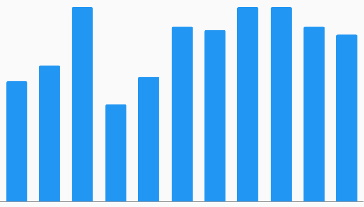

# Spark Bar Bar Chart Example



Example:

```
/// Spark Bar Example
import 'package:flutter_web/material.dart';
import 'package:charts_flutter_web/flutter.dart' as charts;

/// Example of a Spark Bar by hiding both axis, reducing the chart margins.
class SparkBar extends StatelessWidget {
  final List<charts.Series> seriesList;
  final bool animate;

  SparkBar(this.seriesList, {this.animate});

  factory SparkBar.withSampleData() {
    return  SparkBar(
      _createSampleData(),
      // Disable animations for image tests.
      animate: false,
    );
  }


  @override
  Widget build(BuildContext context) {
    return  charts.BarChart(
      seriesList,
      animate: animate,

      /// Assign a custom style for the measure axis.
      ///
      /// The NoneRenderSpec only draws an axis line (and even that can be hidden
      /// with showAxisLine=false).
      primaryMeasureAxis:
           charts.NumericAxisSpec(renderSpec:  charts.NoneRenderSpec()),

      /// This is an OrdinalAxisSpec to match up with BarChart's default
      /// ordinal domain axis (use NumericAxisSpec or DateTimeAxisSpec for
      /// other charts).
      domainAxis:  charts.OrdinalAxisSpec(
          // Make sure that we draw the domain axis line.
          showAxisLine: true,
          // But don't draw anything else.
          renderSpec:  charts.NoneRenderSpec()),

      // With a spark chart we likely don't want large chart margins.
      // 1px is the smallest we can make each margin.
      layoutConfig:  charts.LayoutConfig(
          leftMarginSpec:  charts.MarginSpec.fixedPixel(0),
          topMarginSpec:  charts.MarginSpec.fixedPixel(0),
          rightMarginSpec:  charts.MarginSpec.fixedPixel(0),
          bottomMarginSpec:  charts.MarginSpec.fixedPixel(0)),
    );
  }

  /// Create series list with single series
  static List<charts.Series<OrdinalSales, String>> _createSampleData() {
    final globalSalesData = [
       OrdinalSales('2007', 3100),
       OrdinalSales('2008', 3500),
       OrdinalSales('2009', 5000),
       OrdinalSales('2010', 2500),
       OrdinalSales('2011', 3200),
       OrdinalSales('2012', 4500),
       OrdinalSales('2013', 4400),
       OrdinalSales('2014', 5000),
       OrdinalSales('2015', 5000),
       OrdinalSales('2016', 4500),
       OrdinalSales('2017', 4300),
    ];

    return [
       charts.Series<OrdinalSales, String>(
        id: 'Global Revenue',
        domainFn: (OrdinalSales sales, _) => sales.year,
        measureFn: (OrdinalSales sales, _) => sales.sales,
        data: globalSalesData,
      ),
    ];
  }
}

/// Sample ordinal data type.
class OrdinalSales {
  final String year;
  final int sales;

  OrdinalSales(this.year, this.sales);
}
```
