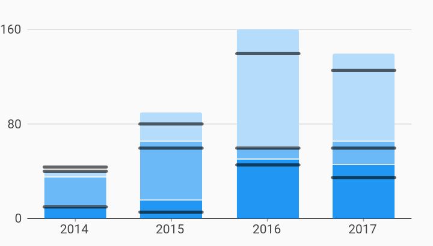

# Stacked Target Line Bar Chart Example



Example:

```
/// Bar chart example
import 'package:flutter_web/material.dart';
import 'package:charts_flutter_web/flutter.dart' as charts;

class StackedBarTargetLineChart extends StatelessWidget {
  final List<charts.Series> seriesList;
  final bool animate;

  StackedBarTargetLineChart(this.seriesList, {this.animate});

  /// Creates a stacked [BarChart] with sample data and no transition.
  factory StackedBarTargetLineChart.withSampleData() {
    return  StackedBarTargetLineChart(
      _createSampleData(),
      // Disable animations for image tests.
      animate: false,
    );
  }


  @override
  Widget build(BuildContext context) {
    return  charts.BarChart(seriesList,
        animate: animate,
        barGroupingType: charts.BarGroupingType.stacked,
        customSeriesRenderers: [
           charts.BarTargetLineRendererConfig<String>(
              // ID used to link series to this renderer.
              customRendererId: 'customTargetLine',
              groupingType: charts.BarGroupingType.stacked)
        ]);
  }

  /// Create series list with multiple series
  static List<charts.Series<OrdinalSales, String>> _createSampleData() {
    final desktopSalesData = [
       OrdinalSales('2014', 5),
       OrdinalSales('2015', 25),
       OrdinalSales('2016', 100),
       OrdinalSales('2017', 75),
    ];

    final tableSalesData = [
       OrdinalSales('2014', 25),
       OrdinalSales('2015', 50),
       OrdinalSales('2016', 10),
       OrdinalSales('2017', 20),
    ];

    final mobileSalesData = [
       OrdinalSales('2014', 10),
       OrdinalSales('2015', 15),
       OrdinalSales('2016', 50),
       OrdinalSales('2017', 45),
    ];

    final desktopTargetLineData = [
       OrdinalSales('2014', 4),
       OrdinalSales('2015', 20),
       OrdinalSales('2016', 80),
       OrdinalSales('2017', 65),
    ];

    final tableTargetLineData = [
       OrdinalSales('2014', 30),
       OrdinalSales('2015', 55),
       OrdinalSales('2016', 15),
       OrdinalSales('2017', 25),
    ];

    final mobileTargetLineData = [
       OrdinalSales('2014', 10),
       OrdinalSales('2015', 5),
       OrdinalSales('2016', 45),
       OrdinalSales('2017', 35),
    ];

    return [
       charts.Series<OrdinalSales, String>(
        id: 'Desktop',
        domainFn: (OrdinalSales sales, _) => sales.year,
        measureFn: (OrdinalSales sales, _) => sales.sales,
        data: desktopSalesData,
      ),
       charts.Series<OrdinalSales, String>(
        id: 'Tablet',
        domainFn: (OrdinalSales sales, _) => sales.year,
        measureFn: (OrdinalSales sales, _) => sales.sales,
        data: tableSalesData,
      ),
       charts.Series<OrdinalSales, String>(
        id: 'Mobile',
        domainFn: (OrdinalSales sales, _) => sales.year,
        measureFn: (OrdinalSales sales, _) => sales.sales,
        data: mobileSalesData,
      ),
       charts.Series<OrdinalSales, String>(
        id: 'Desktop Target Line',
        domainFn: (OrdinalSales sales, _) => sales.year,
        measureFn: (OrdinalSales sales, _) => sales.sales,
        data: desktopTargetLineData,
      )
        // Configure our custom bar target renderer for this series.
        ..setAttribute(charts.rendererIdKey, 'customTargetLine'),
       charts.Series<OrdinalSales, String>(
        id: 'Tablet Target Line',
        domainFn: (OrdinalSales sales, _) => sales.year,
        measureFn: (OrdinalSales sales, _) => sales.sales,
        data: tableTargetLineData,
      )
        // Configure our custom bar target renderer for this series.
        ..setAttribute(charts.rendererIdKey, 'customTargetLine'),
       charts.Series<OrdinalSales, String>(
        id: 'Mobile Target Line',
        domainFn: (OrdinalSales sales, _) => sales.year,
        measureFn: (OrdinalSales sales, _) => sales.sales,
        data: mobileTargetLineData,
      )
        // Configure our custom bar target renderer for this series.
        ..setAttribute(charts.rendererIdKey, 'customTargetLine'),
    ];
  }
}

/// Sample ordinal data type.
class OrdinalSales {
  final String year;
  final int sales;

  OrdinalSales(this.year, this.sales);
}
```
