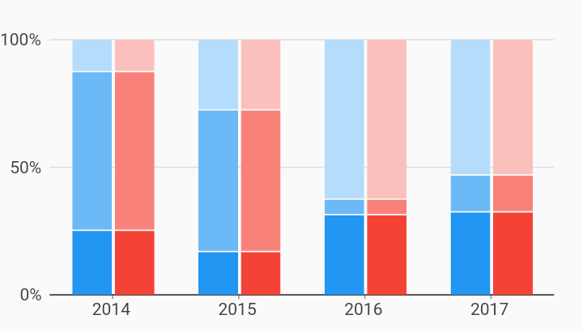

# Percent Of Domain By Category Interactions Example



Example:

```
/// Example of a percentage bar chart with grouped, stacked series oriented
/// vertically.
///
/// Each bar stack shows the percentage of each measure out of the total measure
/// value of the stack.
import 'package:flutter_web/material.dart';
import 'package:charts_flutter_web/flutter.dart' as charts;

class PercentOfDomainByCategoryBarChart extends StatelessWidget {
  final List<charts.Series> seriesList;
  final bool animate;

  PercentOfDomainByCategoryBarChart(this.seriesList, {this.animate});

  factory PercentOfDomainByCategoryBarChart.withSampleData() {
    return  PercentOfDomainByCategoryBarChart(
      createSampleData(),
      // Disable animations for image tests.
      animate: false,
    );
  }


  @override
  Widget build(BuildContext context) {
    return  charts.BarChart(
      seriesList,
      animate: animate,
      barGroupingType: charts.BarGroupingType.groupedStacked,
      // Configures a [PercentInjector] behavior that will calculate measure
      // values as the percentage of the total of all data that shares both a
      // domain and a series category.
      //
      // We use this option on a grouped stacked bar chart to ensure that the
      // total value for each bar stack is 100%. A stacked bar chart that does
      // not group by series category would use the "domain" option.
      behaviors: [
         charts.PercentInjector<String>(
            totalType: charts.PercentInjectorTotalType.domainBySeriesCategory)
      ],
      // Configure the axis spec to show percentage values.
      primaryMeasureAxis:  charts.PercentAxisSpec(),
    );
  }

  /// Create series list with multiple series
  static List<charts.Series<OrdinalSales, String>> createSampleData() {
    final desktopSalesDataA = [
       OrdinalSales('2014', 5),
       OrdinalSales('2015', 25),
       OrdinalSales('2016', 100),
       OrdinalSales('2017', 75),
    ];

    final tableSalesDataA = [
       OrdinalSales('2014', 25),
       OrdinalSales('2015', 50),
       OrdinalSales('2016', 10),
       OrdinalSales('2017', 20),
    ];

    final mobileSalesDataA = [
       OrdinalSales('2014', 10),
       OrdinalSales('2015', 15),
       OrdinalSales('2016', 50),
       OrdinalSales('2017', 45),
    ];

    final desktopSalesDataB = [
       OrdinalSales('2014', 5),
       OrdinalSales('2015', 25),
       OrdinalSales('2016', 100),
       OrdinalSales('2017', 75),
    ];

    final tableSalesDataB = [
       OrdinalSales('2014', 25),
       OrdinalSales('2015', 50),
       OrdinalSales('2016', 10),
       OrdinalSales('2017', 20),
    ];

    final mobileSalesDataB = [
       OrdinalSales('2014', 10),
       OrdinalSales('2015', 15),
       OrdinalSales('2016', 50),
       OrdinalSales('2017', 45),
    ];

    return [
       charts.Series<OrdinalSales, String>(
        id: 'Desktop A',
        seriesCategory: 'A',
        domainFn: (OrdinalSales sales, _) => sales.year,
        measureFn: (OrdinalSales sales, _) => sales.sales,
        data: desktopSalesDataA,
      ),
       charts.Series<OrdinalSales, String>(
        id: 'Tablet A',
        seriesCategory: 'A',
        domainFn: (OrdinalSales sales, _) => sales.year,
        measureFn: (OrdinalSales sales, _) => sales.sales,
        data: tableSalesDataA,
      ),
       charts.Series<OrdinalSales, String>(
        id: 'Mobile A',
        seriesCategory: 'A',
        domainFn: (OrdinalSales sales, _) => sales.year,
        measureFn: (OrdinalSales sales, _) => sales.sales,
        data: mobileSalesDataA,
      ),
       charts.Series<OrdinalSales, String>(
        id: 'Desktop B',
        seriesCategory: 'B',
        domainFn: (OrdinalSales sales, _) => sales.year,
        measureFn: (OrdinalSales sales, _) => sales.sales,
        data: desktopSalesDataB,
      ),
       charts.Series<OrdinalSales, String>(
        id: 'Tablet B',
        seriesCategory: 'B',
        domainFn: (OrdinalSales sales, _) => sales.year,
        measureFn: (OrdinalSales sales, _) => sales.sales,
        data: tableSalesDataB,
      ),
       charts.Series<OrdinalSales, String>(
        id: 'Mobile B',
        seriesCategory: 'B',
        domainFn: (OrdinalSales sales, _) => sales.year,
        measureFn: (OrdinalSales sales, _) => sales.sales,
        data: mobileSalesDataB,
      ),
    ];
  }
}

/// Sample ordinal data type.
class OrdinalSales {
  final String year;
  final int sales;

  OrdinalSales(this.year, this.sales);
}
```
