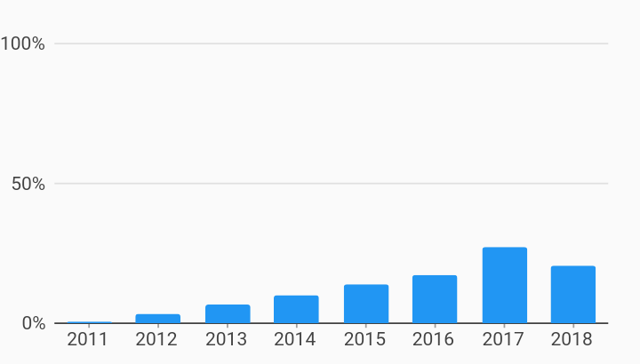

# Percent Of Series Interactions Example



Example:

```
/// Example of a percentage bar chart which shows each bar as the percentage of
/// the total series measure value.
import 'package:flutter_web/material.dart';
import 'package:charts_flutter_web/flutter.dart' as charts;

class PercentOfSeriesBarChart extends StatelessWidget {
  final List<charts.Series> seriesList;
  final bool animate;

  PercentOfSeriesBarChart(this.seriesList, {this.animate});

  /// Creates a stacked [BarChart] with sample data and no transition.
  factory PercentOfSeriesBarChart.withSampleData() {
    return  PercentOfSeriesBarChart(
      _createSampleData(),
      // Disable animations for image tests.
      animate: false,
    );
  }


  @override
  Widget build(BuildContext context) {
    return  charts.BarChart(
      seriesList,
      animate: animate,
      barGroupingType: charts.BarGroupingType.grouped,
      // Configures a [PercentInjector] behavior that will calculate measure
      // values as the percentage of the total of all data in its series.
      behaviors: [
         charts.PercentInjector(
            totalType: charts.PercentInjectorTotalType.series)
      ],
      // Configure the axis spec to show percentage values.
      primaryMeasureAxis:  charts.PercentAxisSpec(),
    );
  }

  /// Create series list with multiple series
  static List<charts.Series<OrdinalSales, String>> _createSampleData() {
    final desktopSalesData = [
       OrdinalSales('2011', 5),
       OrdinalSales('2012', 25),
       OrdinalSales('2013', 50),
       OrdinalSales('2014', 75),
       OrdinalSales('2015', 100),
       OrdinalSales('2016', 125),
       OrdinalSales('2017', 200),
       OrdinalSales('2018', 150),
    ];

    return [
       charts.Series<OrdinalSales, String>(
        id: 'Desktop',
        domainFn: (OrdinalSales sales, _) => sales.year,
        measureFn: (OrdinalSales sales, _) => sales.sales,
        data: desktopSalesData,
      ),
    ];
  }
}

/// Sample ordinal data type.
class OrdinalSales {
  final String year;
  final int sales;

  OrdinalSales(this.year, this.sales);
}
```
