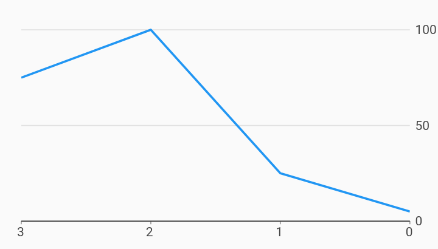

# Rtl Line Chart i18n Example



Example:

```
/// RTL Line chart example
import 'package:charts_flutter_web/flutter.dart' as charts;
import 'package:flutter_web/material.dart';

class RTLLineChart extends StatelessWidget {
  final List<charts.Series> seriesList;
  final bool animate;

  RTLLineChart(this.seriesList, {this.animate});

  /// Creates a [LineChart] with sample data and no transition.
  factory RTLLineChart.withSampleData() {
    return  RTLLineChart(
      _createSampleData(),
      // Disable animations for image tests.
      animate: false,
    );
  }


  @override
  Widget build(BuildContext context) {
    // Charts will determine if RTL is enabled by checking the directionality by
    // requesting Directionality.of(context). This returns the text direction
    // from the closest instance of that encloses the context passed to build
    // the chart. A [TextDirection.rtl] will be treated as a RTL chart. This
    // means that the directionality widget does not have to directly wrap each
    // chart. It is show here as an example only.
    //
    // By default, when a chart detects RTL:
    // Measure axis positions are flipped. Primary measure axis is on the right
    // and the secondary measure axis is on the left (when used).
    // Domain axis' first domain starts on the right and grows left.
    return  Directionality(
        textDirection: TextDirection.rtl,
        child:  charts.LineChart(
          seriesList,
          animate: animate,
        ));
  }

  /// Create one series with sample hard coded data.
  static List<charts.Series<LinearSales, int>> _createSampleData() {
    final data = [
       LinearSales(0, 5),
       LinearSales(1, 25),
       LinearSales(2, 100),
       LinearSales(3, 75),
    ];

    return [
       charts.Series<LinearSales, int>(
        id: 'Sales',
        domainFn: (LinearSales sales, _) => sales.year,
        measureFn: (LinearSales sales, _) => sales.sales,
        data: data,
      )
    ];
  }
}

/// Sample linear data type.
class LinearSales {
  final int year;
  final int sales;

  LinearSales(this.year, this.sales);
}
```
