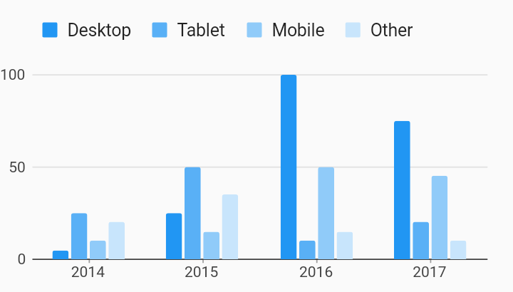

# Simple Series Legend Legends Example



Example:

```
/// Bar chart with series legend example
import 'package:flutter_web/material.dart';
import 'package:charts_flutter_web/flutter.dart' as charts;

class SimpleSeriesLegend extends StatelessWidget {
  final List<charts.Series> seriesList;
  final bool animate;

  SimpleSeriesLegend(this.seriesList, {this.animate});

  factory SimpleSeriesLegend.withSampleData() {
    return  SimpleSeriesLegend(
      _createSampleData(),
      // Disable animations for image tests.
      animate: false,
    );
  }


  @override
  Widget build(BuildContext context) {
    return  charts.BarChart(
      seriesList,
      animate: animate,
      barGroupingType: charts.BarGroupingType.grouped,
      // Add the series legend behavior to the chart to turn on series legends.
      // By default the legend will display above the chart.
      behaviors: [ charts.SeriesLegend()],
    );
  }

  /// Create series list with multiple series
  static List<charts.Series<OrdinalSales, String>> _createSampleData() {
    final desktopSalesData = [
       OrdinalSales('2014', 5),
       OrdinalSales('2015', 25),
       OrdinalSales('2016', 100),
       OrdinalSales('2017', 75),
    ];

    final tabletSalesData = [
       OrdinalSales('2014', 25),
       OrdinalSales('2015', 50),
       OrdinalSales('2016', 10),
       OrdinalSales('2017', 20),
    ];

    final mobileSalesData = [
       OrdinalSales('2014', 10),
       OrdinalSales('2015', 15),
       OrdinalSales('2016', 50),
       OrdinalSales('2017', 45),
    ];

    final otherSalesData = [
       OrdinalSales('2014', 20),
       OrdinalSales('2015', 35),
       OrdinalSales('2016', 15),
       OrdinalSales('2017', 10),
    ];

    return [
       charts.Series<OrdinalSales, String>(
        id: 'Desktop',
        domainFn: (OrdinalSales sales, _) => sales.year,
        measureFn: (OrdinalSales sales, _) => sales.sales,
        data: desktopSalesData,
      ),
       charts.Series<OrdinalSales, String>(
        id: 'Tablet',
        domainFn: (OrdinalSales sales, _) => sales.year,
        measureFn: (OrdinalSales sales, _) => sales.sales,
        data: tabletSalesData,
      ),
       charts.Series<OrdinalSales, String>(
        id: 'Mobile',
        domainFn: (OrdinalSales sales, _) => sales.year,
        measureFn: (OrdinalSales sales, _) => sales.sales,
        data: mobileSalesData,
      ),
       charts.Series<OrdinalSales, String>(
        id: 'Other',
        domainFn: (OrdinalSales sales, _) => sales.year,
        measureFn: (OrdinalSales sales, _) => sales.sales,
        data: otherSalesData,
      ),
    ];
  }
}

/// Sample ordinal data type.
class OrdinalSales {
  final String year;
  final int sales;

  OrdinalSales(this.year, this.sales);
}
```
