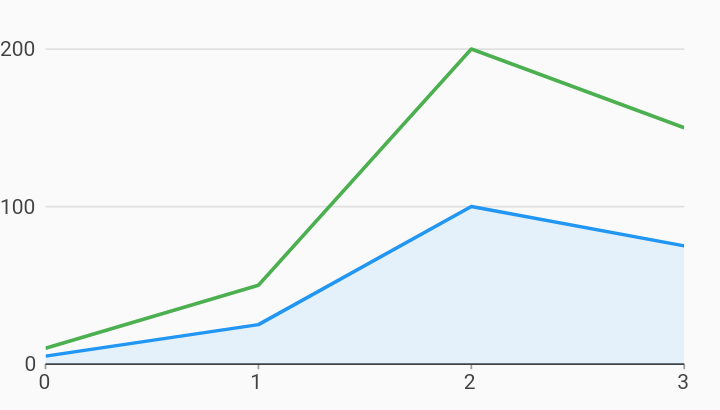

# Area And Line Line Chart Example



Example:

```
/// Line chart example
import 'package:charts_flutter_web/flutter.dart' as charts;
import 'package:flutter_web/material.dart';

class AreaAndLineChart extends StatelessWidget {
  final List<charts.Series> seriesList;
  final bool animate;

  AreaAndLineChart(this.seriesList, {this.animate});

  /// Creates a [LineChart] with sample data and no transition.
  factory AreaAndLineChart.withSampleData() {
    return  AreaAndLineChart(
      _createSampleData(),
      // Disable animations for image tests.
      animate: false,
    );
  }


  @override
  Widget build(BuildContext context) {
    return  charts.LineChart(seriesList,
        animate: animate,
        customSeriesRenderers: [
           charts.LineRendererConfig(
              // ID used to link series to this renderer.
              customRendererId: 'customArea',
              includeArea: true,
              stacked: true),
        ]);
  }

  /// Create one series with sample hard coded data.
  static List<charts.Series<LinearSales, int>> _createSampleData() {
    final myFakeDesktopData = [
       LinearSales(0, 5),
       LinearSales(1, 25),
       LinearSales(2, 100),
       LinearSales(3, 75),
    ];

    var myFakeTabletData = [
       LinearSales(0, 10),
       LinearSales(1, 50),
       LinearSales(2, 200),
       LinearSales(3, 150),
    ];

    return [
       charts.Series<LinearSales, int>(
        id: 'Desktop',
        colorFn: (_, __) => charts.MaterialPalette.blue.shadeDefault,
        domainFn: (LinearSales sales, _) => sales.year,
        measureFn: (LinearSales sales, _) => sales.sales,
        data: myFakeDesktopData,
      )
        // Configure our custom bar target renderer for this series.
        ..setAttribute(charts.rendererIdKey, 'customArea'),
       charts.Series<LinearSales, int>(
        id: 'Tablet',
        colorFn: (_, __) => charts.MaterialPalette.green.shadeDefault,
        domainFn: (LinearSales sales, _) => sales.year,
        measureFn: (LinearSales sales, _) => sales.sales,
        data: myFakeTabletData,
      ),
    ];
  }
}

/// Sample linear data type.
class LinearSales {
  final int year;
  final int sales;

  LinearSales(this.year, this.sales);
}
```
