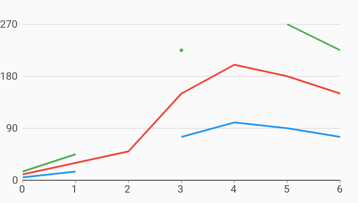

# Simple Nulls Line Chart Example



Example:

```
/// Example of a line chart with null measure values.
///
/// Null values will be visible as gaps in lines and area skirts. Any data
/// points that exist between two nulls in a line will be rendered as an
/// isolated point, as seen in the green series.
import 'package:charts_flutter_web/flutter.dart' as charts;
import 'package:flutter_web/material.dart';

class SimpleNullsLineChart extends StatelessWidget {
  final List<charts.Series> seriesList;
  final bool animate;

  SimpleNullsLineChart(this.seriesList, {this.animate});

  /// Creates a [LineChart] with sample data and no transition.
  factory SimpleNullsLineChart.withSampleData() {
    return  SimpleNullsLineChart(
      _createSampleData(),
      // Disable animations for image tests.
      animate: false,
    );
  }


  @override
  Widget build(BuildContext context) {
    return  charts.LineChart(seriesList, animate: animate);
  }

  /// Create one series with sample hard coded data.
  static List<charts.Series<LinearSales, int>> _createSampleData() {
    final myFakeDesktopData = [
       LinearSales(0, 5),
       LinearSales(1, 15),
       LinearSales(2, null),
       LinearSales(3, 75),
       LinearSales(4, 100),
       LinearSales(5, 90),
       LinearSales(6, 75),
    ];

    final myFakeTabletData = [
       LinearSales(0, 10),
       LinearSales(1, 30),
       LinearSales(2, 50),
       LinearSales(3, 150),
       LinearSales(4, 200),
       LinearSales(5, 180),
       LinearSales(6, 150),
    ];

    final myFakeMobileData = [
       LinearSales(0, 15),
       LinearSales(1, 45),
       LinearSales(2, null),
       LinearSales(3, 225),
       LinearSales(4, null),
       LinearSales(5, 270),
       LinearSales(6, 225),
    ];

    return [
       charts.Series<LinearSales, int>(
        id: 'Desktop',
        colorFn: (_, __) => charts.MaterialPalette.blue.shadeDefault,
        domainFn: (LinearSales sales, _) => sales.year,
        measureFn: (LinearSales sales, _) => sales.sales,
        data: myFakeDesktopData,
      ),
       charts.Series<LinearSales, int>(
        id: 'Tablet',
        colorFn: (_, __) => charts.MaterialPalette.red.shadeDefault,
        domainFn: (LinearSales sales, _) => sales.year,
        measureFn: (LinearSales sales, _) => sales.sales,
        data: myFakeTabletData,
      ),
       charts.Series<LinearSales, int>(
        id: 'Mobile',
        colorFn: (_, __) => charts.MaterialPalette.green.shadeDefault,
        domainFn: (LinearSales sales, _) => sales.year,
        measureFn: (LinearSales sales, _) => sales.sales,
        data: myFakeMobileData,
      ),
    ];
  }
}

/// Sample linear data type.
class LinearSales {
  final int year;
  final int sales;

  LinearSales(this.year, this.sales);
}
```
