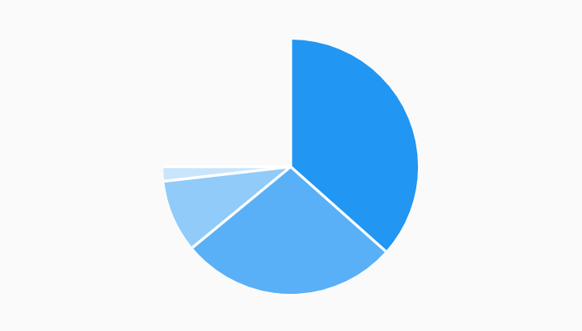

# Partial Pie Pie Chart Example



Example:

```
/// Partial pie chart example, where the data does not cover a full revolution
/// in the chart.
import 'package:charts_flutter_web/flutter.dart' as charts;
import 'package:flutter_web/material.dart';

class PartialPieChart extends StatelessWidget {
  final List<charts.Series> seriesList;
  final bool animate;

  PartialPieChart(this.seriesList, {this.animate});

  /// Creates a [PieChart] with sample data and no transition.
  factory PartialPieChart.withSampleData() {
    return  PartialPieChart(
      _createSampleData(),
      // Disable animations for image tests.
      animate: false,
    );
  }


  @override
  Widget build(BuildContext context) {
    // Configure the pie to display the data across only 3/4 instead of the full
    // revolution.
    return  charts.PieChart(seriesList,
        animate: animate,
        defaultRenderer:  charts.ArcRendererConfig(arcLength: 3 / 2 * pi));
  }

  /// Create one series with sample hard coded data.
  static List<charts.Series<LinearSales, int>> _createSampleData() {
    final data = [
       LinearSales(0, 100),
       LinearSales(1, 75),
       LinearSales(2, 25),
       LinearSales(3, 5),
    ];

    return [
       charts.Series<LinearSales, int>(
        id: 'Sales',
        domainFn: (LinearSales sales, _) => sales.year,
        measureFn: (LinearSales sales, _) => sales.sales,
        data: data,
      )
    ];
  }
}

/// Sample linear data type.
class LinearSales {
  final int year;
  final int sales;

  LinearSales(this.year, this.sales);
}
```
