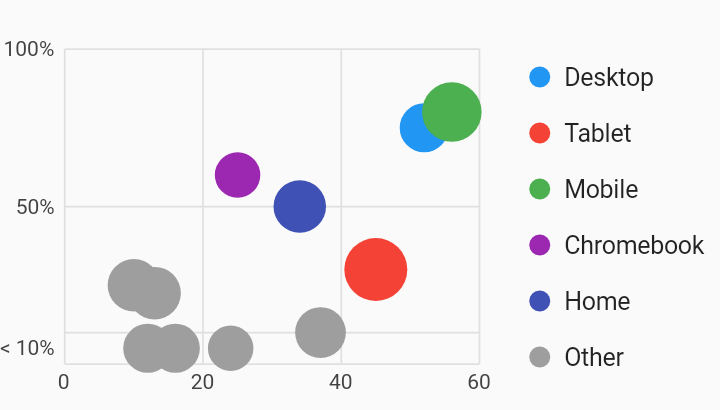

# Bucketing Axis Scatter Plot Chart Example



Example:

```
/// Example of a scatter plot chart with a bucketing measure axis and a legend.
///
/// A bucketing measure axis positions all values beneath a certain threshold
/// into a reserved space on the axis range. The label for the bucket line will
/// be drawn in the middle of the bucket range, rather than aligned with the
/// gridline for that value's position on the scale.
import 'package:charts_flutter_web/flutter.dart' as charts;
import 'package:flutter_web/material.dart';

class BucketingAxisScatterPlotChart extends StatelessWidget {
  final List<charts.Series> seriesList;
  final bool animate;

  BucketingAxisScatterPlotChart(this.seriesList, {this.animate});

  /// Creates a [ScatterPlotChart] with sample data and no transition.
  factory BucketingAxisScatterPlotChart.withSampleData() {
    return  BucketingAxisScatterPlotChart(
      _createSampleData(),
      // Disable animations for image tests.
      animate: false,
    );
  }


  @override
  Widget build(BuildContext context) {
    return  charts.ScatterPlotChart(seriesList,
        // Set up a bucketing axis that will place all values below 0.1 (10%)
        // into a bucket at the bottom of the chart.
        //
        // Configure a tick count of 3 so that we get 100%, 50%, and the
        // threshold.
        primaryMeasureAxis:  charts.BucketingAxisSpec(
            threshold: 0.1,
            tickProviderSpec:  charts.BucketingNumericTickProviderSpec(
                desiredTickCount: 3)),
        // Add a series legend to display the series names.
        behaviors: [
           charts.SeriesLegend(position: charts.BehaviorPosition.end),
        ],
        animate: animate);
  }

  /// Create one series with sample hard coded data.
  static List<charts.Series<LinearSales, int>> _createSampleData() {
    final myFakeDesktopData = [
       LinearSales(52, 0.75, 14.0),
    ];

    final myFakeTabletData = [
       LinearSales(45, 0.3, 18.0),
    ];

    final myFakeMobileData = [
       LinearSales(56, 0.8, 17.0),
    ];

    final myFakeChromebookData = [
       LinearSales(25, 0.6, 13.0),
    ];

    final myFakeHomeData = [
       LinearSales(34, 0.5, 15.0),
    ];

    final myFakeOtherData = [
       LinearSales(10, 0.25, 15.0),
       LinearSales(12, 0.075, 14.0),
       LinearSales(13, 0.225, 15.0),
       LinearSales(16, 0.03, 14.0),
       LinearSales(24, 0.04, 13.0),
       LinearSales(37, 0.1, 14.5),
    ];

    return [
       charts.Series<LinearSales, int>(
          id: 'Desktop',
          colorFn: (LinearSales sales, _) =>
              charts.MaterialPalette.blue.shadeDefault,
          domainFn: (LinearSales sales, _) => sales.year,
          measureFn: (LinearSales sales, _) => sales.revenueShare,
          radiusPxFn: (LinearSales sales, _) => sales.radius,
          data: myFakeDesktopData),
       charts.Series<LinearSales, int>(
          id: 'Tablet',
          colorFn: (LinearSales sales, _) =>
              charts.MaterialPalette.red.shadeDefault,
          domainFn: (LinearSales sales, _) => sales.year,
          measureFn: (LinearSales sales, _) => sales.revenueShare,
          radiusPxFn: (LinearSales sales, _) => sales.radius,
          data: myFakeTabletData),
       charts.Series<LinearSales, int>(
          id: 'Mobile',
          colorFn: (LinearSales sales, _) =>
              charts.MaterialPalette.green.shadeDefault,
          domainFn: (LinearSales sales, _) => sales.year,
          measureFn: (LinearSales sales, _) => sales.revenueShare,
          radiusPxFn: (LinearSales sales, _) => sales.radius,
          data: myFakeMobileData),
       charts.Series<LinearSales, int>(
          id: 'Chromebook',
          colorFn: (LinearSales sales, _) =>
              charts.MaterialPalette.purple.shadeDefault,
          domainFn: (LinearSales sales, _) => sales.year,
          measureFn: (LinearSales sales, _) => sales.revenueShare,
          radiusPxFn: (LinearSales sales, _) => sales.radius,
          data: myFakeChromebookData),
       charts.Series<LinearSales, int>(
          id: 'Home',
          colorFn: (LinearSales sales, _) =>
              charts.MaterialPalette.indigo.shadeDefault,
          domainFn: (LinearSales sales, _) => sales.year,
          measureFn: (LinearSales sales, _) => sales.revenueShare,
          radiusPxFn: (LinearSales sales, _) => sales.radius,
          data: myFakeHomeData),
       charts.Series<LinearSales, int>(
          id: 'Other',
          colorFn: (LinearSales sales, _) =>
              charts.MaterialPalette.gray.shadeDefault,
          domainFn: (LinearSales sales, _) => sales.year,
          measureFn: (LinearSales sales, _) => sales.revenueShare,
          radiusPxFn: (LinearSales sales, _) => sales.radius,
          data: myFakeOtherData),
    ];
  }
}

/// Sample linear data type.
class LinearSales {
  final int year;
  final double revenueShare;
  final double radius;

  LinearSales(this.year, this.revenueShare, this.radius);
}
```
