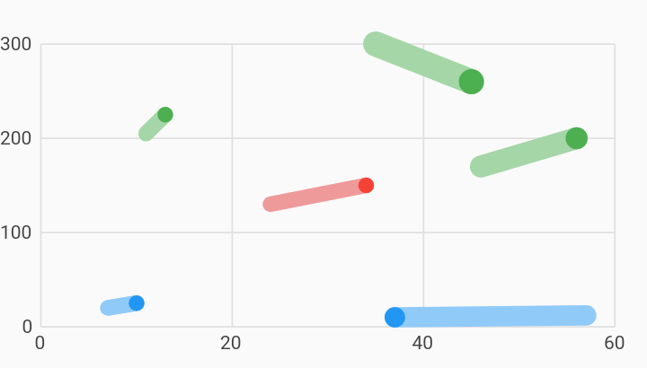

# Comparison Points Scatter Plot Chart Example



Example:

```
/// Line chart example
import 'package:charts_flutter_web/flutter.dart' as charts;
import 'package:flutter_web/material.dart';

class ComparisonPointsScatterPlotChart extends StatelessWidget {
  final List<charts.Series> seriesList;
  final bool animate;

  ComparisonPointsScatterPlotChart(this.seriesList, {this.animate});

  /// Creates a [ScatterPlotChart] with sample data and no transition.
  factory ComparisonPointsScatterPlotChart.withSampleData() {
    return  ComparisonPointsScatterPlotChart(
      _createSampleData(),
      // Disable animations for image tests.
      animate: false,
    );
  }


  @override
  Widget build(BuildContext context) {
    return  charts.ScatterPlotChart(seriesList,
        animate: animate,
        defaultRenderer:
             charts.PointRendererConfig(pointRendererDecorators: [
           charts.ComparisonPointsDecorator(
              symbolRenderer:  charts.CylinderSymbolRenderer())
        ]));
  }

  /// Create one series with sample hard coded data.
  static List<charts.Series<LinearSales, int>> _createSampleData() {
    final data = [
       LinearSales(10, 7, 10, 25, 20, 25, 5.0),
       LinearSales(13, 11, 13, 225, 205, 225, 5.0),
       LinearSales(34, 34, 24, 150, 150, 130, 5.0),
       LinearSales(37, 37, 57, 10, 10, 12, 6.5),
       LinearSales(45, 35, 45, 260, 300, 260, 8.0),
       LinearSales(56, 46, 56, 200, 170, 200, 7.0),
    ];

    final maxMeasure = 300;

    return [
       charts.Series<LinearSales, int>(
        id: 'Sales',
        // Providing a color function is optional.
        colorFn: (LinearSales sales, _) {
          // Bucket the measure column value into 3 distinct colors.
          final bucket = sales.sales / maxMeasure;

          if (bucket < 1 / 3) {
            return charts.MaterialPalette.blue.shadeDefault;
          } else if (bucket < 2 / 3) {
            return charts.MaterialPalette.red.shadeDefault;
          } else {
            return charts.MaterialPalette.green.shadeDefault;
          }
        },
        domainFn: (LinearSales sales, _) => sales.year,
        domainLowerBoundFn: (LinearSales sales, _) => sales.yearLower,
        domainUpperBoundFn: (LinearSales sales, _) => sales.yearUpper,
        measureFn: (LinearSales sales, _) => sales.sales,
        measureLowerBoundFn: (LinearSales sales, _) => sales.salesLower,
        measureUpperBoundFn: (LinearSales sales, _) => sales.salesUpper,
        // Providing a radius function is optional.
        radiusPxFn: (LinearSales sales, _) => sales.radius,
        data: data,
      )
    ];
  }
}

/// Sample linear data type.
class LinearSales {
  final int year;
  final int yearLower;
  final int yearUpper;
  final int sales;
  final int salesLower;
  final int salesUpper;
  final double radius;

  LinearSales(this.year, this.yearLower, this.yearUpper, this.sales,
      this.salesLower, this.salesUpper, this.radius);
}
```
