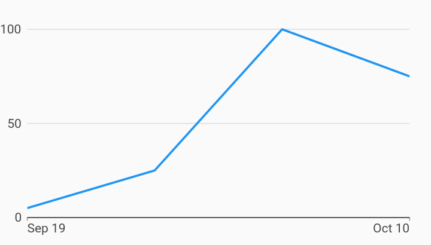

# End Points Axis Time Series Charts Example



Example:

```
/// Example of a time series chart with an end points domain axis.
///
/// An end points axis generates two ticks, one at each end of the axis range.
import 'package:charts_flutter_web/flutter.dart' as charts;
import 'package:flutter_web/material.dart';

class EndPointsAxisTimeSeriesChart extends StatelessWidget {
  final List<charts.Series> seriesList;
  final bool animate;

  EndPointsAxisTimeSeriesChart(this.seriesList, {this.animate});

  /// Creates a [TimeSeriesChart] with sample data and no transition.
  factory EndPointsAxisTimeSeriesChart.withSampleData() {
    return  EndPointsAxisTimeSeriesChart(
      _createSampleData(),
      // Disable animations for image tests.
      animate: false,
    );
  }


  @override
  Widget build(BuildContext context) {
    return  charts.TimeSeriesChart(
      seriesList,
      animate: animate,
      // Configures an axis spec that is configured to render one tick at each
      // end of the axis range, anchored "inside" the axis. The start tick label
      // will be left-aligned with its tick mark, and the end tick label will be
      // right-aligned with its tick mark.
      domainAxis:  charts.EndPointsTimeAxisSpec(),
    );
  }

  /// Create one series with sample hard coded data.
  static List<charts.Series<TimeSeriesSales, DateTime>> _createSampleData() {
    final data = [
       TimeSeriesSales( DateTime(2017, 9, 19), 5),
       TimeSeriesSales( DateTime(2017, 9, 26), 25),
       TimeSeriesSales( DateTime(2017, 10, 3), 100),
       TimeSeriesSales( DateTime(2017, 10, 10), 75),
    ];

    return [
       charts.Series<TimeSeriesSales, DateTime>(
        id: 'Sales',
        colorFn: (_, __) => charts.MaterialPalette.blue.shadeDefault,
        domainFn: (TimeSeriesSales sales, _) => sales.time,
        measureFn: (TimeSeriesSales sales, _) => sales.sales,
        data: data,
      )
    ];
  }
}

/// Sample time series data type.
class TimeSeriesSales {
  final DateTime time;
  final int sales;

  TimeSeriesSales(this.time, this.sales);
}
```
