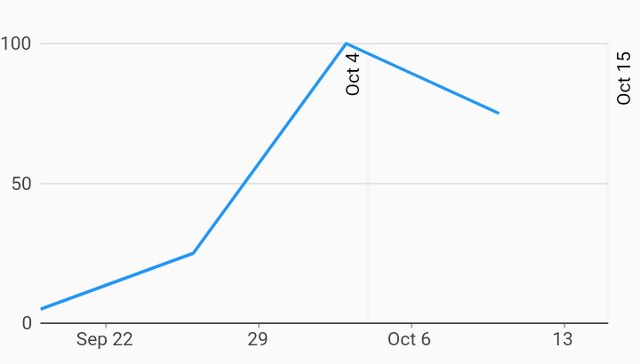

# Line Annotation Time Series Charts Example



Example:

```
/// Time series chart with line annotation example
///
/// The example future range annotation extends beyond the range of the series
/// data, demonstrating the effect of the [Charts.RangeAnnotation.extendAxis]
/// flag. This can be set to false to disable range extension.
///
/// Additional annotations may be added simply by adding additional
/// [Charts.RangeAnnotationSegment] items to the list.
import 'package:charts_flutter_web/flutter.dart' as charts;
import 'package:flutter_web/material.dart';

class TimeSeriesLineAnnotationChart extends StatelessWidget {
  final List<charts.Series> seriesList;
  final bool animate;

  TimeSeriesLineAnnotationChart(this.seriesList, {this.animate});

  /// Creates a [TimeSeriesChart] with sample data and no transition.
  factory TimeSeriesLineAnnotationChart.withSampleData() {
    return  TimeSeriesLineAnnotationChart(
      _createSampleData(),
      // Disable animations for image tests.
      animate: false,
    );
  }


  @override
  Widget build(BuildContext context) {
    return  charts.TimeSeriesChart(seriesList, animate: animate, behaviors: [
       charts.RangeAnnotation([
         charts.LineAnnotationSegment(
             DateTime(2017, 10, 4), charts.RangeAnnotationAxisType.domain,
            startLabel: 'Oct 4'),
         charts.LineAnnotationSegment(
             DateTime(2017, 10, 15), charts.RangeAnnotationAxisType.domain,
            endLabel: 'Oct 15'),
      ]),
    ]);
  }

  /// Create one series with sample hard coded data.
  static List<charts.Series<TimeSeriesSales, DateTime>> _createSampleData() {
    final data = [
       TimeSeriesSales( DateTime(2017, 9, 19), 5),
       TimeSeriesSales( DateTime(2017, 9, 26), 25),
       TimeSeriesSales( DateTime(2017, 10, 3), 100),
       TimeSeriesSales( DateTime(2017, 10, 10), 75),
    ];

    return [
       charts.Series<TimeSeriesSales, DateTime>(
        id: 'Sales',
        domainFn: (TimeSeriesSales sales, _) => sales.time,
        measureFn: (TimeSeriesSales sales, _) => sales.sales,
        data: data,
      )
    ];
  }
}

/// Sample time series data type.
class TimeSeriesSales {
  final DateTime time;
  final int sales;

  TimeSeriesSales(this.time, this.sales);
}
```
